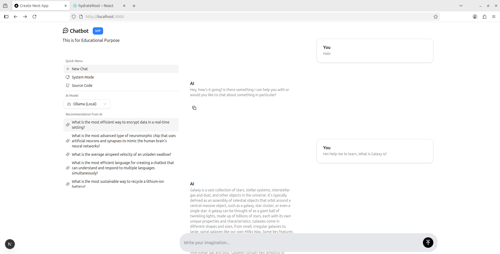
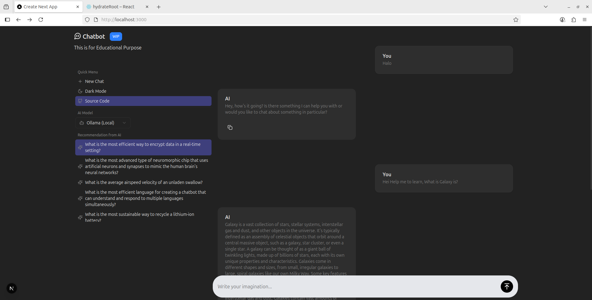

# 🤖 Chatbot AI - Local & Cloud AI Chat UI

A sleek chatbot interface built with **Next.js 15**, **Tailwind CSS**, **Redux Toolkit**, and **shadcn/ui**, supporting **local AI inference (Ollama)** and **cloud-based inference (Cypher Alpha via OpenRouter)**.

> ⚠️ This project currently supports **local model only** (`ollama`).  
> Future support for external API integration is **planned but not yet released**.

## Screenshots

### 🌞 Light Mode



### 🌙 Dark Mode



### ⚙️ System Mode

Automatically switches between light and dark based on your device’s theme.

---

## ✨ Features

- 🔄 **AI models** (local Ollama)
- 🌓 **Theme toggle**: Light, Dark, or System
- 🧠 **AI question suggestions**
- 🆕 **Start new chat**
- ✅ **Copy to clipboard** support
- 🎯 **Responsive design** for desktop & mobile
- 🧩 Clean architecture using `app/` directory

---

## 🧪 Tech Stack

- [Next.js 15](https://nextjs.org/)
- [TypeScript](https://www.typescriptlang.org/)
- [Tailwind CSS](https://tailwindcss.com/)
- [shadcn/ui](https://ui.shadcn.com/)
- [Redux Toolkit](https://redux-toolkit.js.org/)
- [Ollama](https://ollama.com/) (local LLM)
- [OpenRouter](https://openrouter.ai/) (used but not implemented)

---

## 📦 Installation

```bash
# Clone this repo
git clone https://github.com/ellenoireQ/Chatbot.git

# Enter project folder
cd Chatbot

# Install dependencies
npm install

# Make sure you have Ollama running locally
ollama run (model)

# Start the dev server
npm run dev
```

## 🧠 Setting Up Ollama (Local LLM)

This project supports **local AI model inference** using [Ollama](https://ollama.com/), allowing you to run Large Language Models (LLMs) directly on your machine without external APIs or internet access.

---

### ⚙️ Requirements

- OS: **Linux**, **macOS**, or **Windows (WSL2)**
- Architecture: **x86_64** or **ARM64**
- No Docker required!

---

### 📥 Installation

#### On Linux / macOS

```bash
curl -fsSL https://ollama.com/install.sh | sh
```

### 📦 Running

```bash
ollama run <model> # e.g llama3.2:1b
```

> If you're installing any **_model_** please follow this steps, edit these file.

```typescript
page.tsx: line number 98

  //
  //  Handling when User Click Input Button
  //
  const handleSubmit = async () => {
    setLoading(true);
    const res = await fetch("/api/generate", {
      method: "POST",
      headers: { "Content-Type": "application/json" },
      body: JSON.stringify({
        model: "llama3.2:1b", // to your model
        messages: [
          {
            content: prompt,
          },
        ],
      }),
    });
```

```typescript
page.tsx: line number 138

  //
  //  Generate Only One Question
  //
  const handleQuestion = async () => {
    const questionPrompt = `make one question like random question about tech or anything you want, only question like "question" no anything only question. one Question!!`;
    const openai = await fetch("/api/generate", {
      method: "POST",
      body: JSON.stringify({
        model: "llama3.2:1b", // to your model
        messages: [
          {
            content: questionPrompt,
          },
        ],
      }),
    });
```

```typescript
route.tsx: line number 5

    const ollama = await fetch("http://localhost:11434/api/generate", {
    method: "POST",
    headers: { "Content-Type": "application/json" },
    body: JSON.stringify({
      model: "llama3.2:1b", // to your model
      prompt: params,
      stream: false,
    }),
  });
```

## 📚 Docs Reference

### 🔍 References & Technologies I've Learned

- [🧠 Ollama](https://github.com/ollama/ollama) – Local AI model runtime.
- [📦 Redux Toolkit](https://redux-toolkit.js.org/) – State management.
- [🌗 next-themes](https://github.com/pacocoursey/next-themes) – Theme switching.
- [🧩 Shadcn/ui](https://ui.shadcn.com/) – UI component library (Radix UI based).
- [⚡ Lucide](https://lucide.dev/) – Icon set used in the UI.

## 🙌 What I’ve Learned

This project helped me explore:

- Integrating Ollama as a local inference engine.
- Managing app state using Redux Toolkit.
- Dynamic UI rendering with Shadcn/ui & Radix-based components.
- Handling theme switching with next-themes and Redux integration.
